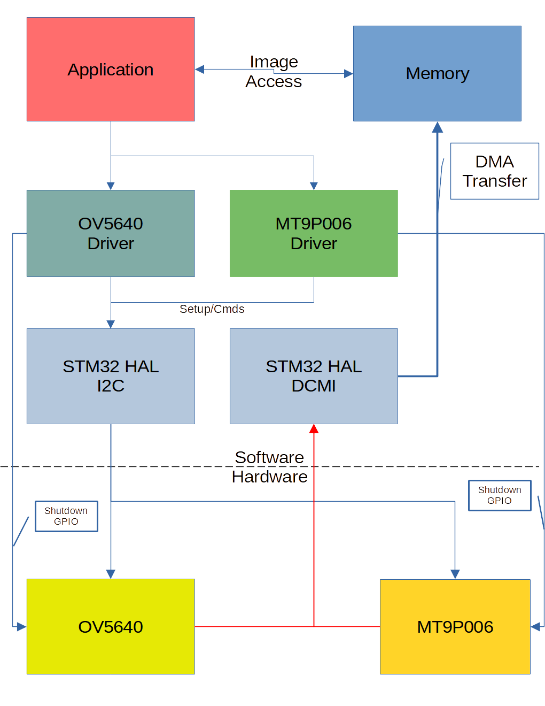

# Imager

The Satellite's primary goal is to capture high resolution photos of the surface of the earth.

In order to accomplish this, the satellite is equipped with two cameras.

1. OV5640 image sensor (Wide angle camera)
    * Connected to the camera board via ribbon cable
    * 5 MP (2592 H x 1944 V)
    * 250 m/pix GSD
    * 67 degree FOV
    * Optical Format 1/4"
2. MT9P006 image sensor (telephoto)
    * Directedly soldered to camera board
    * 5 MP (2592 H x 1944 V)
    * 50 m/pix GSD
    * 12 degree FOV
    * Optical Format 1/2.5"

Both cameras have a I/O line dedicated to shutting down the sensor. These two lines will allow us have the image sensors share data busses; by only having one sensors active at a time. Each sensor is connected to two data busses: DCMI (parallel) and I2C. The I2C bus is used to command and configure the sensor. The DCMI bus is used to transfer image data.

The DCMI bus is accessible via a DMA (direct memory access) master. This allows data to be transferred out of the DCMI bus hardware to a memory location without using the CPU.

