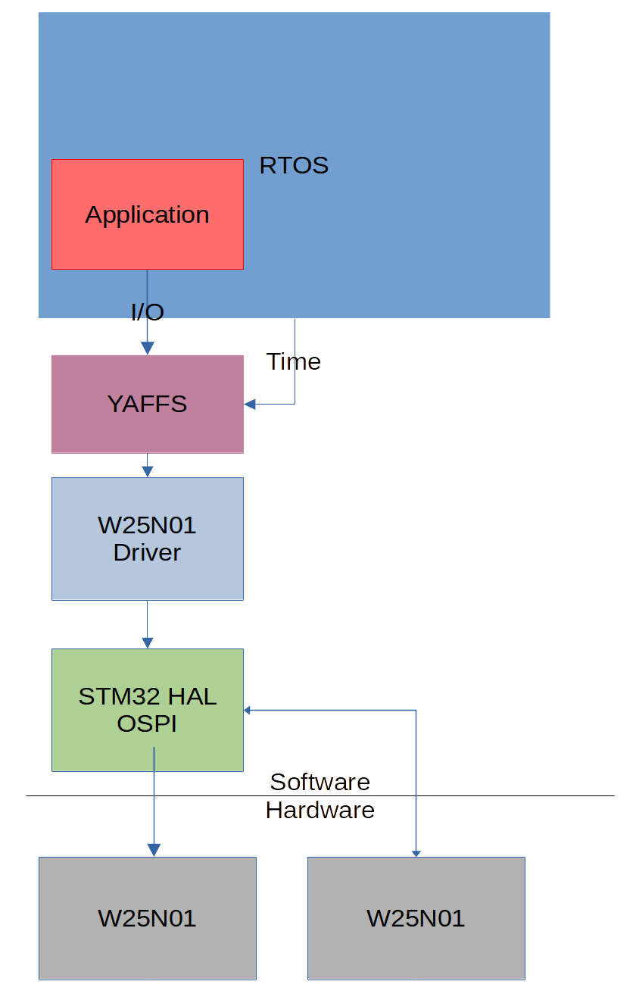

# Persistent Storage

OBC flight is equipped with 2x 1Gbit W25N01GW Winbond QSPI NAND flash chips.
These chips are 1Gbit, or 128M-byte in size. They are connected to the STM32H7 primary microcontroller via QSPI.
However, from the perspective of the STM32H7 these two chips are connected to a OCTOSPI interface, which is then split into two QSPI interfaces.

One issue with these NAND chips is that they have a 128K-Byte block size. Which means that the **minimum** amount of data that can be erased in one operation is 128K-bytes. NAND flash may also ship with *bad blocks* (blocks that cannot be read from or written to), or develop them in there lifespan. NAND flash also experiences significant wear on writes/erases (W25N01 is rated for 10,000 cycles), necessitating the use of special data organization to ensure *wear leveling*.

Luckily, there are filesystems designed for this exact application.
The filesystem we chose for our satellite is **YAFFS** (<https://yaffs.net/>).
YAFFS is designed to directly interact with and handle NAND flash. This will allow us to abstract away complex NAND file handing and be able to simply access files from a *POSIX-like interface*. 

Yaffs also supplies a special wrapped for RTOS's, called *Yaffs Direct Interface*. We will be using this wrapped to integrate YAFFS with FREERTOS.

# Usage
* Pictures
* Ephemeris Data
* Logging
    * A max file size will be allocated
        * Once this size is reached, the oldest logs will be overwritten
* Firmware images 
    * Images uploaded from the ground station will first be loaded into NAND
    